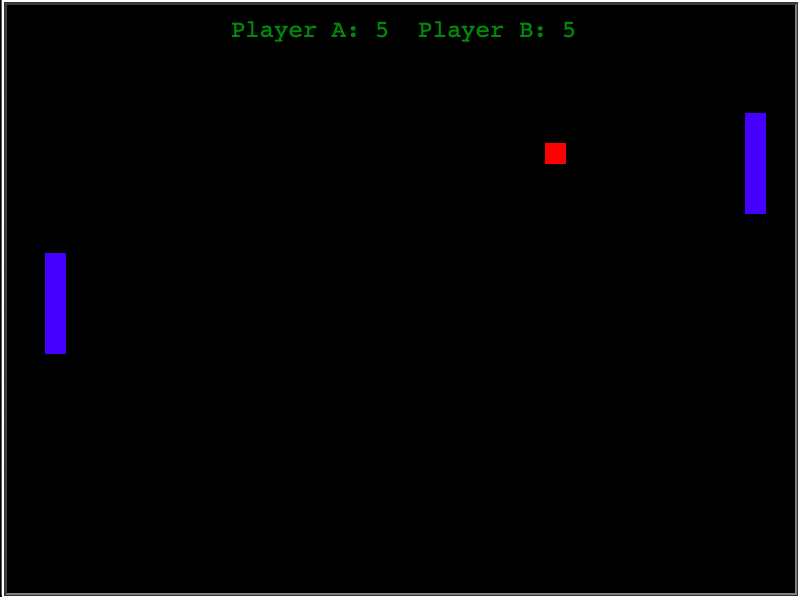

# Pong Game
This is a simple pong game i made that works like any other biult in [python](https://www.python.org). I tweaked the colors so that its not all white.
## Controls
Controls are very simple. For the left paddle you use W for up and S for down. And on the right it is just the up and down keys.
# This is a image of the game for an example:
<p align="center">
    
</p> 

# Installation 

```sh
// Step 1
clone this repo. https://github.com/sixplusgaming/python_pong.git

// Step 2
Run this command in a terminal (Do not use integrated terminal within VS code): python3 ./Pong1.py
```